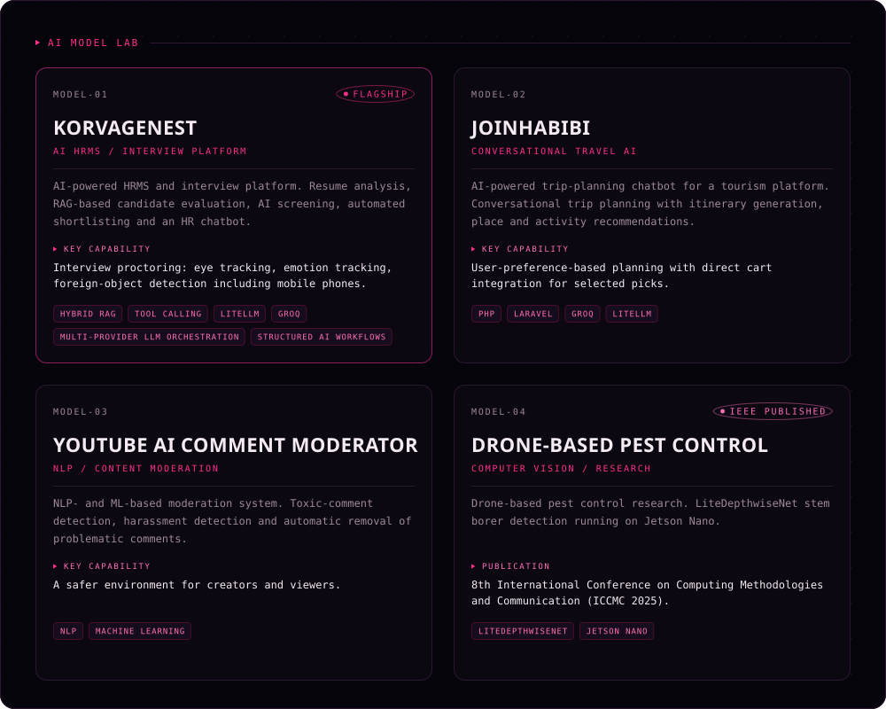

<!--
  AMIRTHA AI — GitHub profile laboratory
  =========================================================================
  This file is an assembly layer only. Every visual is an SVG generated from
  tools/theme.mjs; edit the generators, not this file, and run `npm run build`.

  ASSET SOURCES — two different paths, on purpose:
    assets/*.svg                     static sections, committed to this branch
    raw.githubusercontent .../assets-output/...   regenerated daily by
                                     .github/workflows/generated-assets.yml

  The data-driven assets live on the `assets-output` branch because GitHub
  counts commits to the DEFAULT branch as contributions — publishing a daily
  bot commit to main would add ~365 synthetic contributions a year to the very
  graph activity.svg renders.

  The Research Lab image is wrapped in an anchor because an SVG loaded through
   is inert; its internal <a> does nothing on GitHub.
-->

  <a href="https://amirtha-portfolio-eqvh.vercel.app/"><b>PORTFOLIO</b></a>
  &nbsp;·&nbsp;
  <a href="https://linkedin.com/in/amirtha-thennavan-b6b5962a7"><b>LINKEDIN</b></a>
  &nbsp;·&nbsp;
  <a href="https://github.com/amirthad25"><b>GITHUB</b></a>

Motivated AI and Data Science professional pursuing an M.Tech in Big Data
Analytics, with a B.Tech in Artificial Intelligence &amp; Data Science and
hands-on experience building AI-powered HRMS and chatbot platforms.

<b>Plain text version</b> — the sections above are images; this is the same content as text

### AMIRTHA T — AI Developer

AI / ML · Big Data · Computer Vision

Motivated AI and Data Science professional pursuing an M.Tech in Big Data
Analytics, with a B.Tech in Artificial Intelligence & Data Science and hands-on
experience building AI-powered HRMS and chatbot platforms.

### Neural Core

Generative AI → Machine Learning → NLP → Computer Vision → Big Data

Also: Agentic AI, Deep Learning, Data Science, Exploratory Data Analysis.

Substrate: Python, SQL, Groq, LiteLLM, RAG, Tool Calling, n8n.

### AI Model Lab

**KorvageNest** — AI HRMS / interview platform *(flagship)*
AI-powered HRMS and interview platform. Resume analysis, RAG-based candidate
evaluation, AI screening, automated shortlisting and an HR chatbot.
Key capability: interview proctoring — eye tracking, emotion tracking,
foreign-object detection including mobile phones.
Hybrid RAG · Tool Calling · LiteLLM · Groq · Multi-provider LLM orchestration ·
Structured AI workflows

**JoinHabibi** — conversational travel AI
AI-powered trip-planning chatbot for a tourism platform. Conversational trip
planning with itinerary generation, place and activity recommendations.
Key capability: user-preference-based planning with direct cart integration for
selected picks.
PHP · Laravel · Groq · LiteLLM

**YouTube AI Comment Moderator** — NLP / content moderation
NLP- and ML-based moderation system. Toxic-comment detection, harassment
detection and automatic removal of problematic comments.
Key capability: a safer environment for creators and viewers.
NLP · Machine Learning

**Drone-Based Pest Control** — computer vision / research *(IEEE published)*
Drone-based pest control research. LiteDepthwiseNet stem borer detection
running on Jetson Nano.
Publication: 8th International Conference on Computing Methodologies and
Communication (ICCMC 2025).
LiteDepthwiseNet · Jetson Nano

### AMIRTHA AI Activity & Developer Analytics

Live GitHub data, refreshed daily by GitHub Actions. Contribution calendar,
public repository count, contributions and streaks over the last year, and
language distribution by bytes across public repositories. Current figures are
rendered in the images above.

### Currently Training

M.Tech in Big Data Analytics, Vel Tech University, 2025–2027.
Program timeline: year 2 of 2. CGPA 8.7.

Prior: B.Tech in Artificial Intelligence & Data Science, Vel Tech University,
2021–2025, CGPA 8.09.

### Research Lab

**Drone-Based Pest Control: LiteDepthwiseNet Stem Borer Detection on Jetson Nano**
Published at the 8th International Conference on Computing Methodologies and
Communication (ICCMC 2025).
[View publication on IEEE Xplore](https://ieeexplore.ieee.org/abstract/document/11140884)

Research focus: Generative AI, Agentic AI, Machine Learning, Deep Learning,
NLP, Computer Vision, Big Data Analytics.

### Links

- [Portfolio](https://amirtha-portfolio-eqvh.vercel.app/)
- [LinkedIn](https://linkedin.com/in/amirtha-thennavan-b6b5962a7)
- [GitHub](https://github.com/amirthad25)

